# Buổi 2
## 1.Lý thuyết về thiết kế cơ sở dữ liệu.
- Thiết kế cơ sở dữ liệu là quá trình xây dựng cấu trúc cho một CSDL nhằm xác định cách thức lưu trữ, tổ chức và truy cập dữ liệu. Quá trình này bao gồm: 
    - Xác định các yêu cầu của hệ thống
    - Định nghĩa lược đồ CSDL
    - Phân tích các thực thể và mối quan hệ giữa chúng
    - Xác định các kiểu dữ liệu và phương thức lưu trữ tối ưu nhất
- Một số lợi ích mà một CSDL hiệu quả đem lại: 

    - **Tối ưu hóa hiệu suất:** Thiết kế cơ sở dữ liệu hiệu quả sẽ giúp cải thiện khả năng truy cập, tăng tốc độ xử lý và rút ngắn thời gian phản hồi đến máy chủ, giúp giảm thiểu tình trạng tắc nghẽn hệ thống do xử lý chậm, đảm bảo hoạt động kinh doanh diễn ra suôn sẻ.
    - **Đảm bảo tính toàn vẹn dữ liệu:** Thiết kế cơ sở dữ liệu chuẩn sẽ giúp đảm bảo sự nhất quán của dữ liệu, tránh tình trạng lưu trữ những dữ liệu bị dư thừa. Điều này giúp đảm bảo tuân thủ các ràng buộc dữ liệu, duy trì tính chính xác và đáng tin cậy của thông tin.
    - **Dễ dàng bảo trì và mở rộng:** Một cơ sở dữ liệu được thiết kế tốt sẽ dễ dàng bảo trì, giúp tiết kiệm thời gian và công sức cho việc cập nhật và sửa chữa. Thiết kế linh hoạt cũng cho phép mở rộng cơ sở dữ liệu một cách dễ dàng khi nhu cầu của doanh nghiệp tăng lên.
    - **Tiết kiệm tài nguyên:** Thiết kế hiệu quả giúp sử dụng tài nguyên hệ thống một cách tối ưu, giảm chi phí phần cứng và phần mềm. Việc loại bỏ dữ liệu trùng lặp và không cần thiết cũng giảm yêu cầu về bộ nhớ và không gian lưu trữ.
    - **Nâng cao bảo mật:** Một cơ sở dữ liệu được thiết kế tốt sẽ có các cơ chế bảo mật mạnh mẽ, bảo vệ dữ liệu khỏi các mối đe dọa và truy cập trái phép. Áp dụng các quyền truy cập và kiểm soát dữ liệu giúp đảm bảo rằng chỉ những người có thẩm quyền mới có thể truy cập và chỉnh sửa dữ liệu.
    - **Hỗ trợ việc đưa ra quyết định:** Dữ liệu được tổ chức và lưu trữ một cách khoa học sẽ giúp việc phân tích và khai thác dữ liệu hiệu quả hơn. Điều này đảm bảo dữ liệu luôn được cung cấp một cách chính xác, hỗ trợ cho việc đưa ra các quyết định kinh doanh của doanh nghiệp.
### Như thế nào là một thiết kế cơ sở dữ liệu tốt?
Một thiết kế CSDL tốt cần phải có cấu trúc rõ ràng, hiệu quả và linh hoạt để đáp ứng nhu cầu của tổ chức. Cụ thể:

- **Được chuẩn hóa:** Nghĩa là dữ liệu được phân chia thành các bảng nhỏ có quan hệ với nhau, giúp loại bỏ sự dư thừa và cải thiện tính toàn vẹn, hiệu quả của dữ liệu.
- **Có tính hiệu quả:**Đảm bảo sử dụng tối ưu các nguồn lực như dung lượng lưu trữ và công suất xử lý, để các truy vấn được thực hiện nhanh chóng. 
- **Có tính linh hoạt:** Có thể thích ứng với các yêu cầu và dữ liệu mới mà không cần thiết kế lại toàn bộ hệ thống.
- **Có khả năng mở rộng:** Để xử lý lượng dữ liệu và truy vấn ngày càng tăng mà không làm giảm hiệu suất. 
- **Đảm bảo an toàn:** Có các biện pháp bảo vệ dữ liệu khỏi truy cập và thao tác trái phép, duy trì tính bảo mật và toàn vẹn của dữ liệu.
## 2.Lược đồ quan hệ E-R (Entity-Relationship).
- **Vai trò của mô hình E-R trong quá trình thiết kế cơ sở dữ liệu:**
    - Mục tiêu của mô hình E-R trong quá trình thiết kế cơ sở dữ liệu đó là phân tích dữ liệu, xác định các đơn vị thông tin cơ bản cần thiết của tổ chức, mô tả cấu trúc và mối liên hệ giữa chúng
    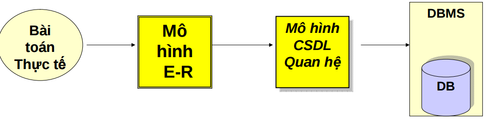
    - E-R là mô hình trung gian để chuyển những yêu cầu quản lý dữ liệu trong thế giới thực thành mô hình cơ sở dữ liệu quan hệ
- **Các thành phần cơ bản của mô hình E-R:**
    1. **Thực thể và tập thực thể**
    - Thực thể là một đối tượng trong thế giới thực.
    - Một nhóm bao gồm các thực thể tương tự nhau tạo thành một tập thực thể
    > Ví dụ: “Quản lý các dự án của công ty”

        Một nhân viên là một thực thể
        Tập hợp các nhân viên là tập thực thể
        Một dự án là một thực thể
        Tập hợp các dự án là tập thực thể
        Một phòng ban là một thực thể
        Tập hợp các phòng ban là tập thực thể
    2. **Thuộc tính**
    - Mỗi tập thực thể có một tập các tính chất đặc trưng, mỗi tính chất đặc trưng này gọi là thuộc tính của tập thực thể. Ứng với mỗi thuộc tính có một tập các giá trị cho thuộc tính đó gọi là miền giá trị.

    - Miền giá trị của thuộc tính gồm các loại giá trị như sau:

        - Kiểu chuỗi (string)
        - Kiểu số nguyên (integer)
        - Kiểu số thực (real)
        - ...
    - Thuộc tính bao gồm các loại như sau:
        - Thuộc tính đơn – không thể tách nhỏ ra được
        - Thuộc tính phức hợp – có thể tách ra thành các thành phần nhỏ hơn
    - Các loại giá trị của thuộc tính:
        - Đơn trị: các thuộc tính có giá trị duy nhất cho một thực thể (VD: số CMND, …)
        - Đa trị: các thuộc tính có một tập giá trị cho cùng một thực thể (VD: bằng cấp, …)
        - Suy diễn được (năm sinh <----> tuổi)
    - Mỗi thực thể đều được phân biệt bởi thuộc tính khóa
    3. **Mối quan hệ giữa các tập thực thể:**
    - Quan hệ là sự liên kết giữa hai hay nhiều tập thực thể

    - Ví dụ giữa tập thực thể NHANVIEN và PHONGBAN có các liên kết như sau:

        - Một nhân viên thuộc một phòng ban nào đó
        - Một phòng ban có một nhân viên làm trưởng phòng
    - Tập quan hệ là tập hợp các mối quan hệ giống nhau
    4. **Lược đồ E-R :**
    - Là đồ thị biểu diễn các tập thực thể, thuộc tính và mối quan hệ
    - Các ký hiệu trong lược đồ E-R
        - **Đỉnh:** 
            
        - **Cung:** là đường nối giữa tập thực thể và thuộc tính, mối quan hệ và tập thực thể
        Ví dụ lược đồ E-R:
            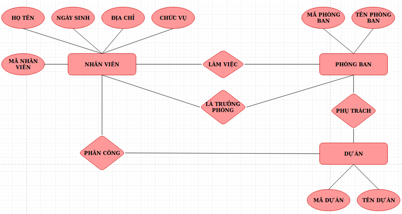
    5. **Các kiểu liên kết trong lược đồ E-R:**
        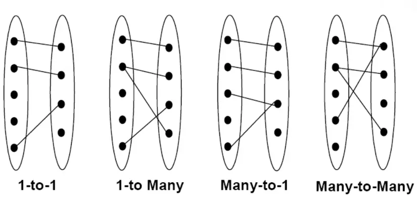
    6. **Thuộc tính khóa:**
    - Mỗi tập thực thể phải có 1 khóa

    - Một khóa có thể có 1 hay nhiều thuộc tính

    - Có thể có nhiều khóa trong 1 tập thực thể, ta sẽ chọn ra 1 khóa làm khóa chính cho tập thực thể đó
- **Xây dựng mô hình E-R**
1. **Quy tắc:**
    - Chính xác
    - Tránh trùng lặp
    - Dễ hiểu
    - Chọn đúng mối quan hệ
    - Chọn đúng kiểu thuộc tính
2. **Các bước xây dựng:**

    - Liệt kê, chọn lọc thông tin
    - Xác định tập thực thể
    - Xác định mối quan hệ
    - Xác định thuộc tính và gắn thuộc tính cho tập thực thể và mối quan hệ
    - Quyết định thuộc tính khóa
    - Vẽ biểu đồ mô hình thực thể E-R
    Chuẩn hóa biểu đồ

## 3. Mô hình dữ liệu quan hệ.
- Mô hình dữ liệu quan hệ biểu diễn cơ sở dữ liệu dưới dạng một tập hợp các quan hệ (bảng giá trị). Mỗi bảng giá trị có các cột và hàng được gọi lần lượt là thuộc tính (attributes) và bộ giá trị (tuples). Mỗi bộ giá trị (tuple) kí hiệu một thực thể hoặc mối quan hệ trong thế giới thực. Tên của quan hệ và tên của các thuộc tính sẽ góp phần giải thích ý nghĩa của từng bộ.
- Về cơ bản, có thể hiểu RDM dựa trên một số điểm chính sau đây:
    - Cơ sở dữ liệu là một tập hợp các quan hệ có liên quan (bảng giá trị).
    - Mỗi quan hệ có một tên gọi riêng cho biết loại tuple (bộ dữ liệu) mà quan hệ có. 
    - Mỗi quan hệ có một tập hợp các thuộc tính (tên cột) đại diện cho các tính chất hoặc các đặc trưng của từng thực thể.
    - Một bộ – tuple (hàng) biểu diễn một thực thể với các các giá trị tương ứng với từng thuộc tính.
    - Mỗi cột trong bảng còn được gọi là một trường (field)
    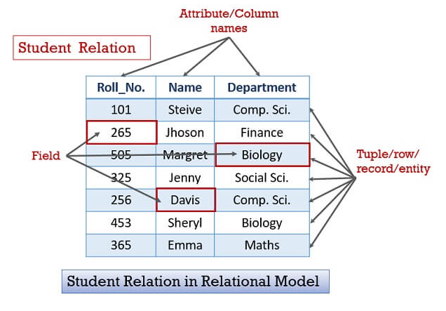

- **Đặc điểm của mô hình cơ sở dữ liệu quan hệ:**
Một cơ sở dữ liệu có thể chứa một số lượng nhất định các quan hệ. Để giảm thiểu tối đa trường hợp sai sót, mỗi quan hệ phải được xác định là duy nhất. Dưới đây là một số đặc điểm giúp tự động phân biệt các quan hệ trong cơ sở dữ liệu
    1. Mỗi quan hệ trong cơ sở dữ liệu phải có một tên riêng biệt và duy nhất để phân biệt nó với các quan hệ khác trong cơ sở dữ liệu.

    2. Một quan hệ không được có hai thuộc tính trùng tên. Mỗi thuộc tính phải có một tên riêng biệt.

    3. Trong một quan hệ không được xuất hiện các bộ giá trị trùng lặp.
    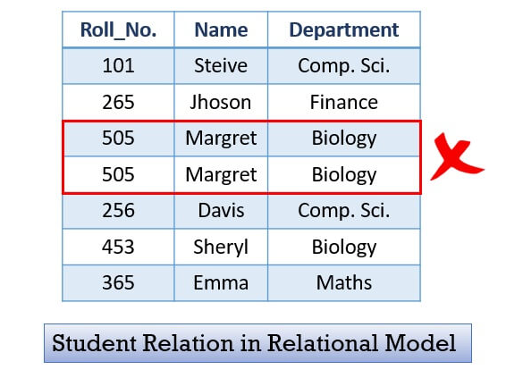
        > Các bộ giá trị trùng lặp không được xuất hiện trong một quan hệ
    
    4. Mỗi bộ phải có chính xác một giá trị dữ liệu cho một thuộc tính

        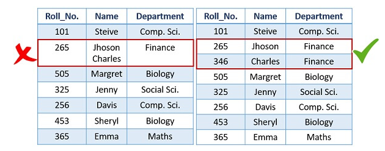

        > Một thuộc tính tương ứng với chính xác một giá trị dữ liệu
    5. Các bộ (tuples) hay các thuộc tính (attributes) trong một quan hệ đều không nhất thiết phải tuân theo một thứ tự nhất định
- **Các ràng buộc của mô hình quan hệ:**
    - Ràng buộc chính là những hạn chế được chỉ định cho các giá trị dữ liệu trong cơ sở dữ liệu quan hệ. Có thể kể đến các ràng buộc chính như sau:
        - Inherent Model-Based Constraints (Ràng buộc dựa trên mô hình vốn có). Ví dụ, một quan hệ trong cơ sở dữ liệu không được có các bộ giá trị trùng lặp, tuy nhiên, không có bất cứ ràng buộc nào trong thứ tự của các bộ giá trị và thuộc tính.
        - Schema-Based Constraints (Ràng buộc dựa trên lược đồ) Các ràng buộc được chỉ định trong khi xác định lược đồ của cơ sở dữ liệu sử dụng DDL là các ràng buộc dựa trên lược đồ. Chúng được phân loại cụ thể thành ràng buộc miền, ràng buộc khóa, ràng buộc tính toàn vẹn thực thể, ràng buộc toàn vẹn tham chiếu và ràng buộc trên giá trị rỗng
        - Application-based Constraints (Ràng buộc dựa trên ứng dụng): Các ràng buộc không thể áp dụng trong khi xác định lược đồ cơ sở dữ liệu sẽ được thể hiện trong các chương trình ứng dụng.
## 4. Chuẩn hóa dữ liệu: 1NF, 2NF, 3NF.
- Chuẩn hoá là quá trình tối ưu hóa cấu trúc của cơ sở dữ liệu để đạt được hiệu suất tốt nhất và giảm thiểu sự dư thừa dữ liệu. Có ba cấp độ chuẩn hoá chính, được gọi là NF (Normal Forms):

1. **Chuẩn hoá 1NF (First Normal Form):** 

Đảm bảo rằng mỗi ô trong bảng chỉ chứa một giá trị nguyên tử (tức là không thể tách nhỏ thành các giá trị con) và không có tập hợp giá trị. Điều này đảm bảo rằng dữ liệu trong bảng không có sự trùng lặp và dễ dàng quản lý.

- Bảng Product:

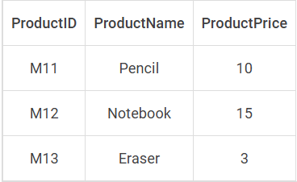

Ví dụ: Trong bảng “Product”, mỗi sản phẩm có một ID duy nhất, tên sản phẩm và một mô tả. Mỗi ô trong cột ID sản phẩm chỉ chứa một giá trị duy nhất, không có nhiều giá trị.

2. **Chuẩn hóa 2NF (Second Normal Form):** 

Đầu tiên, bảng phải thỏa mãn chuẩn hóa 1NF, đồng thời nếu mỗi cột không phải là một phần của khóa chính thì phải hoàn toàn phụ thuộc vào toàn bộ khóa chính (áp dụng cho bảng có khóa chính được tạo từ 2 cột trở lên). Điều này loại bỏ sự phụ thuộc chức năng giữa các cột và giúp giảm thiểu sự dư thừa. 

- Bảng OrderDetails:

   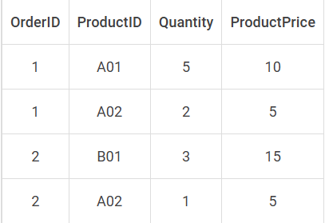

Ví dụ trên ta có bảng OrderDetails với các cột OrderID, ProductID (cả hai tạo thành khóa chính), Quantity và ProductPrice. Ở đây, ProductPrice có thể chỉ phụ thuộc vào ProductID và không phụ thuộc vào OrderID. Điều này vi phạm 2NF vì ProductPrice là phụ thuộc chức năng riêng của Product mà không phụ thuộc vào toàn bộ khóa chính. Do đó, việc lưu trữ ProductPrice trong bảng OrderDetails là không cần thiết và gây ra sự trùng lặp dữ liệu. Để đạt được 2NF, bạn cần tách ProductPrice ra khỏi bảng OrderDetails và đặt nó trong một bảng Product như sau:
- Bảng Product:

- Cập nhật bảng OrderDetails:

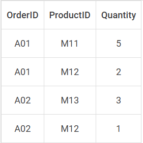

3. **Chuẩn hoá 3NF (Third Normal Form):** 

Bảng phải ở dạng 2NF và không có sự phụ thuộc chức năng giữa các cột phi khóa chính. Các cột phi khóa chính phải phụ thuộc duy nhất vào khóa chính, không phụ thuộc vào các cột phi khóa chính khác. Điều này giúp loại bỏ sự dư thừa và đảm bảo tính nhất quán của dữ liệu.

- Bảng Customer:
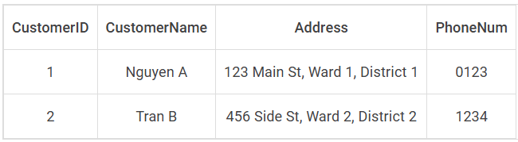

Ví dụ: Trong bảng “Customer”, nếu thông tin về địa chỉ (tên đường, phường/xã, quận/huyện của khách hàng được lưu trữ trong cùng một bảng, điều này dẫn đến vi phạm 3NF vì 3 giá trị này đều phụ thuộc vào nhau. Để tuân thủ 3NF, các thông tin về địa chỉ nên được tách riêng thành 1 bảng “Address”.

- Bảng Address:

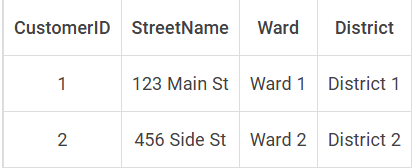